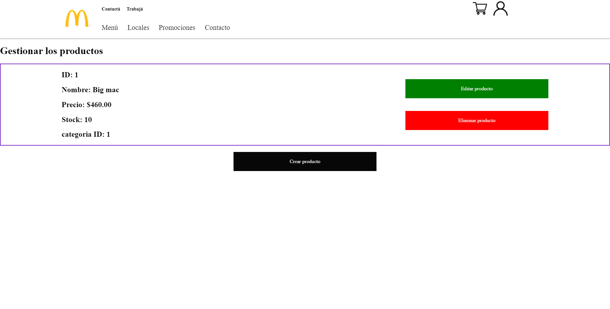

**ENGLISH**

# **Virtual shop MCdonalds** php, mysql, javascript, MVC, POO

This is my store inspired by food chain model (MC).

**Advice**
I put the images of the page at the end of the documentation.

## Components Frontend

The store has a pushbar (library JS **Warning: it has been modified**), that is activated if you place your mouse over the sections: menu and promotions. if you would want disable it you have to put the mouse out.
Also, i structured the famous "product cards" both for the index and menu.
the whole page is made with vainilla css how i like it!

These (product cards) are dynamically printed thanks the backend!

## Components Backend

The backend and logic is made in pure php based on a MVC design pattern and the paradigm POO.
The database is in mysql.
I don't use libraries for help. In the case i create helpers->
**such as:**
deletesession = remove a session variable with a function. that simple.
isAdmin = check if the user has a permission to access the site.
getProducts = get all information (from database) to print in one view (controller **PRODUCT**).
it has particular pages for the admin user. So they can create, edit, delete categories and products.

## things to improve

The page is incomplete, since they haven't been programmed functionalities such as **purchase** - use the table **"lineas-pedidos"** - layout other **pages** - **shopping options**

## Images

**index**

**menu page**

**pushbar, example**

**create and login page**

**if is admin, will be shown options**

**manage product**

